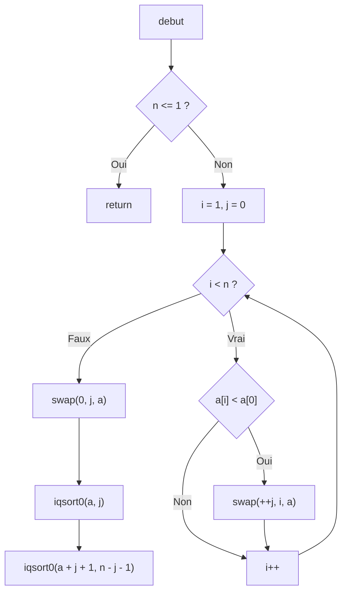

Evan atherly : DEV1 <br>
Pablo sene : DEV2 <br>
Alexis lambert : DEV3 <br>



```C
void iqsort0 ( int *a , int n )
{
    int i , j ;
    if ( n <=1)
        return ;
    for ( i = 1 , j = 0; i < n ; i ++)
        if ( a [ i ] < a [0])
            swap (++ j , i , a );
    swap (0 , j , a );
    iqsort0 (a , j );
    iqsort0 ( a + j +1 , n -j -1);
 }
 ```