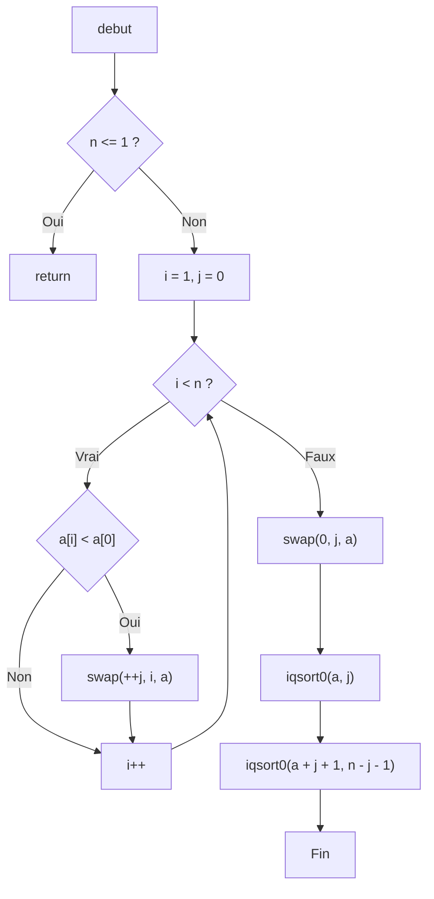

Evan atherly : DEV1 <br>
Pablo sene : DEV2 <br>
Alexis lambert : DEV3 <br>



```C
void iqsort0 ( int *a , int n )
{
    int i , j ;
    if ( n <=1)
        return ;
    for ( i = 1 , j = 0; i < n ; i ++)
        if ( a [ i ] < a [0])
            swap (++ j , i , a );
    swap (0 , j , a );
    iqsort0 (a , j );
    iqsort0 ( a + j +1 , n -j -1);
 }
 ```

## Complexité Cyclomatique 
CC : E − N + 2P<br>
E : Le nombre d'arcs<br>
N : Le nombre de noeuds<br>
P : Nombre de procédures/ fonction dans le code<br>

Dans notre cas 
```
E = 11
N = 10
P = 1
CC = 11 - 10 + 2 * 1 = 2
```
## Complexité Halstead 
**Opérateur :** *+,-,\*,<,>,<=,>=* mais aussi *if, for, return, (), {}, []* 
**Opérande :** Tous les éléments sur lesquels agissent les opérateurs, càd les **variables** les **constantes**, et les **fonctions appelées**
Mesure qui se concentre sur le contenu du code. On vient compter les opérandes et les variables :
- `nt` le nb d’opérateurs distincts
- `Nt` le nb total d’occurrences d’opérateur dans le code
- `nd` le nb d’opérandes distincts
- `Nd` le nb total d’occurences d’opérandes dans le code
- **Longueur du programme** : N = Nt + Nd
- **Vocabulaire du programme** : n = nt + nd
- **Volume**: $V = N \times \log_2(n)$
- **Difficulté** : (nt/2) * (Nd/nd)
- **Effort** : Difficulté * Volume

```
nt = 7
Nt = 35
nd = 8
Nd = 35

Longueur N = 35 + 35 = 70
Vocabulaire n = 7 + 8 = 15
Volume V = 70($\log_2$(15)) = 273.482341693
Difficulté D = (7/2) * (35/8) = 15.3125
Effort E = 273 * 15 = 4095

```

